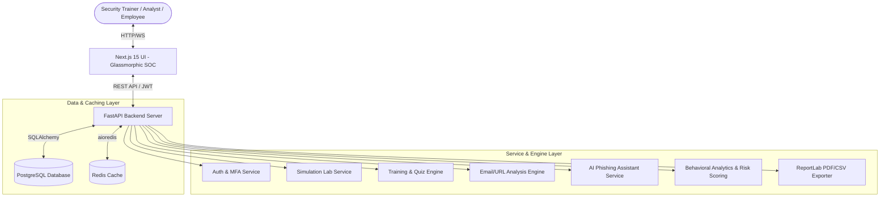

# PhishGuard AI - Phishing Awareness, Simulation & Security Training Platform

PhishGuard AI is a production-grade enterprise cybersecurity awareness and simulation platform designed to educate users on phishing threats in a controlled, risk-free educational environment.

---

## 🏗️ Architecture Diagram



---

## 🛠️ Tech Stack
- **Frontend**: Next.js 15, React, TypeScript, TailwindCSS, Framer Motion, Recharts
- **Backend**: FastAPI (Python), SQLAlchemy, Pydantic, ReportLab
- **Database**: PostgreSQL (Relational Data), SQLite (Local Fallback)
- **Caching**: Redis
- **Authentication**: JWT, Multi-Factor Authentication (MFA)
- **AI Integration**: OpenAI Compatible Client & Heuristic Parsers

---

## 🚀 Installation & Local Development

### Prerequisites
- Python 3.10+
- Node.js 18+
- Docker & Docker Compose (Optional)

### Running with Docker (Recommended)
1. Clone the repository and navigate to the project directory:
   ```bash
   cd "Project 3"
   ```
2. Build and start the services:
   ```bash
   docker compose up --build
   ```
3. Open `http://localhost:3000` for the Web App Dashboard, and `http://localhost:8000/docs` for the interactive OpenAPI docs.

### Manual Backend Setup
1. Navigate to the backend directory:
   ```bash
   cd backend
   ```
2. Create and activate a virtual environment:
   ```bash
   python -m venv venv
   .\venv\Scripts\Activate
   ```
3. Install dependencies:
   ```bash
   pip install -r requirements.txt
   ```
4. Run the development server:
   ```bash
   uvicorn app.main:app --reload --port 8000
   ```

### Manual Frontend Setup
1. Navigate to the frontend directory:
   ```bash
   cd frontend
   ```
2. Install npm packages:
   ```bash
   npm install
   ```
3. Run the Next.js development server:
   ```bash
   npm run dev
   ```

---

## 🧑‍💻 User Manual

### Role Matrix
- **Super Admin**: Full administrative rights, system audits, user administration.
- **Security Trainer**: Creates training courses, lessons, assessments, and campaigns.
- **Analyst**: Generates threat/compliance reports, evaluates department analytics.
- **Student / Employee**: Accesses training modules, quizzes, URLs/email analysis, and safe simulations.

### Key Features
1. **Safe Phishing Simulations**: Test employee readiness with realistic scenarios (Fake Delivery, Fake Password Reset, etc.) without harvest risk.
2. **Interactive Courses**: Step-by-step training lessons covering Smishing, BEC, Vishing, Social Engineering, and Quizzes with instant certification.
3. **Sandbox URL & Email Analysis**: Users paste email headers or URLs to evaluate threat indicator percentages and safety suggestions.
4. **AI Assistant**: A secure chatbot contextually trained to guide users through indicators and answer cybersecurity questions.
5. **Gamification & Leaderboard**: Earn points and unlock achievements (e.g. *Phish Spotter*, *MFA Pioneer*) to top the Security Champion board.
