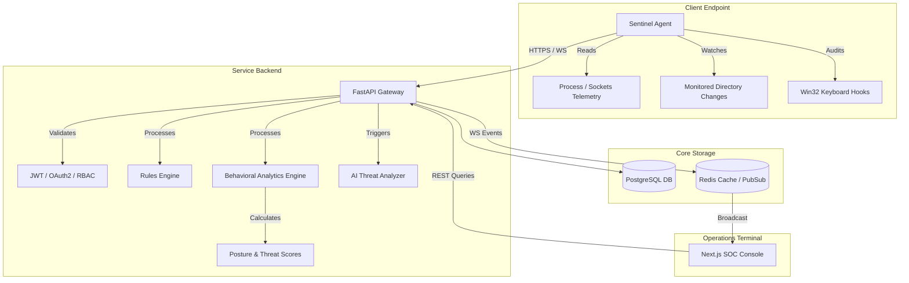

# Platform Architecture Document - SentinelAI EDR

SentinelAI EDR is structured around a decoupled multi-tier design to prioritize low latency, security control, and real-time visualization.

---

## Technical Block Diagram

---

## Module Design Details

### 1. Endpoint Agent Daemon
* Designed to be highly portable with zero compiled binary requirements.
* Performs cross-platform system polling using `psutil`.
* Monitors file creations and edits in dedicated sandbox directories using an interval file-hash auditor.
* Performs security checks for sticky key hijack vectors and logs indicators for hidden rootkit processes.

### 2. FastAPI Gateway Router
* Employs the **Repository Pattern** and **Service Layer Pattern** to decouple API routing from database execution details.
* Implements JWT authentication, OAuth2 password flows, and RFC 6238 TOTP Multi-factor validation.
* **Rules Engine**: Processes structured telemetry filters. Supports wildcard matching (`contains`) and numeric conditions (`greater_than` or `less_than`).
* **Behavioral Engine**: Dynamically calculates user posture scores and records threat ratings based on active incident count and event severity.

### 3. AI Analysis Integration
* Relies on standard OpenAI-compatible API schemas.
* Automatically selects offline template-based diagnostic generation in the event of timeout or missing API keys.
* Strictly maps technical anomalies to the corresponding MITRE ATT&CK techniques.
